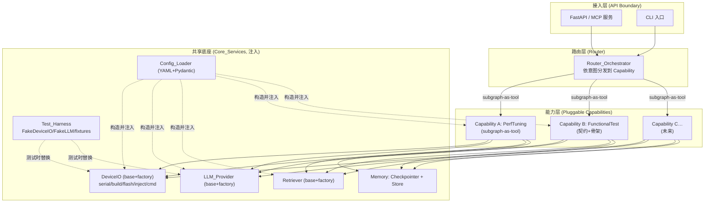
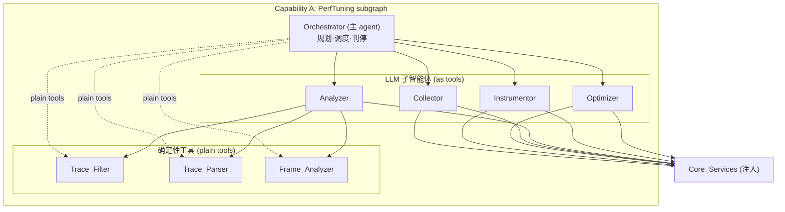
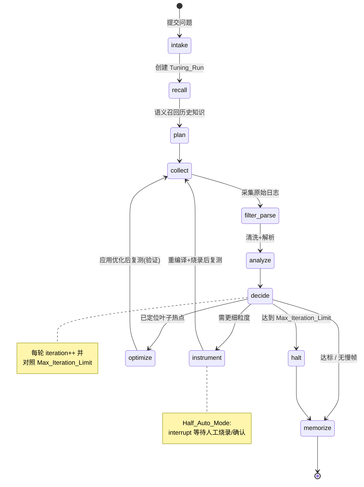

# Design Document

## Overview

嵌入式设备智能体平台是一个由真实 LLM API 驱动、基于 LangGraph（Python）构建的多智能体**平台**：一套共享底座 + 其上可插拔的多个**能力（Capability）**。首个能力 **Capability A（LVGL 性能调优）** 完整实现如下闭环：**采集 → 清洗 → 解析 → 分析 → 下钻埋点 → 优化 → 验证 → 沉淀知识**；第二个能力 **Capability B（嵌入式自动化测试）** 本期交付契约与插件骨架，用以验证平台的扩展性；平台可继续挂载更多能力。

设计遵循四条核心原则：

1. **平台 + 可插拔能力**。每个能力是遵循 `BaseCapability` 契约、自带 subgraph/子智能体/工具/状态的独立模块，经 `CapabilityFactory` 注册；顶层 `Router_Orchestrator` 依意图分发。新增能力零改动核心。
2. **确定性核心与 LLM 推理层严格分离**。trace 的过滤、解析、慢帧/热点检测都是纯函数式的确定性工具（`Trace_Filter` / `Trace_Parser` / `Frame_Analyzer`），可离线单测、可重复；只有需要判断与规划的步骤才作为 LLM 子智能体。
3. **一切副作用皆经接口注入**。串口、编译烧录、LLM 调用、知识存储全部藏在 Base class + Factory 之后，由 YAML 选择实现，测试时替换为 fake/mock。这既满足"换模型/换设备/换 RAG/加能力不改核心"，也是测试 harness 与三级测试策略的基础。共享底座（尤其 DeviceIO）被所有能力复用。
4. **语言无关的 API 边界**。核心能力经由一层与实现语言解耦的 API 暴露，确定性工件序列化为 JSON，为未来的 TS 客户端或 Web UI 留口子。

本设计满足 requirements.md 中全部 20 条需求（需求 1–15 为 Capability A，16–20 为平台层与 Capability B），末尾给出可追溯性映射表。实施将按阶段推进，且**每个子任务完成即写单元测试、每个章节完成即写集成测试**作为一等约束（详细阶段/任务分解见 tasks.md）。

### 技术选型

| 关注点 | 选型 | 理由 |
|--------|------|------|
| 语言 | Python 3.11+ | 嵌入式/串口/trace 分析生态；LangGraph 参考实现；LVGL `trace_filter.py` 即 Python |
| 编排 | LangGraph（`create_agent` + subagents-as-tools） | `langgraph-supervisor` 已停止维护，官方推荐子智能体即工具模式 |
| 静态类型 | type hints + mypy/pyright | 编译期约束 |
| 运行时校验 | Pydantic v2 | 校验 LLM 输出、YAML 配置、跨层数据契约 |
| 短期记忆 | LangGraph Checkpointer | 线程范围运行状态、可恢复 |
| 长期记忆 | LangGraph Store（本地起步）+ BaseRetriever | 跨线程知识、语义召回、可插外部 RAG |
| 串口 | pyserial | 事实标准，可脚本化（优于 minicom） |
| API 边界 | FastAPI（REST）/ 预留 MCP | 语言无关契约 |
| 测试 | pytest + hypothesis | 单元/集成/属性测试（round-trip） |

## Architecture

### 平台分层架构

平台自上而下分为：接入层 → 路由层 → 能力层（可插拔）→ 共享底座。副作用集中在底座，被所有能力复用，便于测试替换。



关键点：
- **Router_Orchestrator** 用 `create_agent` 构建，把每个 Capability 作为**工具（subgraph-as-tool）**调用，依据 Capability 的 `description` 做意图分发（需求 17）。
- **能力层**可插拔：每个能力遵循 `BaseCapability` 契约、经 `CapabilityFactory` 注册，新增能力不改路由与底座（需求 16）。
- **共享底座** `Core_Services` 由 `Config_Loader` 构造一次并注入各能力（需求 18.4）；DeviceIO 被所有能力复用（需求 18.2）。
- **Test_Harness** 在测试时以 FakeDeviceIO/FakeLLMProvider 替换真实底座，驱动任意能力的完整 subgraph（需求 20）。

### Capability A（PerfTuning）内部结构

Capability A 内部即原调优多智能体系统：一个 Orchestrator 协调子智能体与确定性工具。



- **Orchestrator** 把 4 个 LLM 子智能体当作**工具**调用（subagents-as-tools）；把 3 个确定性工具当作**普通工具**调用（虚线，需求 13）。
- **确定性工具**不依赖任何副作用，纯输入输出，是单测主战场。

### 调优闭环状态图

Orchestrator 驱动的 LangGraph 状态图，包含条件分支、迭代上限守卫与人在环中断。



- `instrument` 与 `optimize` 之后都回到 `collect` 复测，形成闭环。
- `decide` 每轮检查 `iteration < Max_Iteration_Limit`，超限走 `halt` 报告最佳证据后收尾（需求 6.5 / 11.5）。
- `Half_Auto_Mode` 在 `collect`（人工触发场景）、`instrument`/`optimize`（人工烧录/批准）处用 LangGraph `interrupt` 暂停，状态由 Checkpointer 保留（需求 10.3 / 11.3）。

### 典型调优时序

```mermaid
sequenceDiagram
    actor Dev as 开发者
    participant API
    participant ORCH as Orchestrator
    participant RET as Retriever
    participant COL as Collector
    participant DIO as DeviceIO
    participant TOOLS as Filter/Parser/FrameAnalyzer
    participant ANA as Analyzer
    participant OPT as Optimizer
    participant MEM as Memory_Store

    Dev->>API: 提交问题(场景描述)
    API->>ORCH: 创建 Tuning_Run(thread_id)
    ORCH->>RET: 按症状语义召回
    RET->>MEM: query
    MEM-->>ORCH: 候选 Knowledge_Record
    ORCH->>COL: 采集场景
    COL->>DIO: open_serial+capture(+inject_input)
    DIO-->>COL: 原始日志工件
    COL->>TOOLS: filter→parse→frame analyze
    TOOLS-->>ANA: 调用树+慢帧+热点
    ANA-->>ORCH: 瓶颈概括(带证据)
    alt 定位到叶子热点
        ORCH->>OPT: 提出优化
        OPT->>DIO: 应用+rebuild+flash
        ORCH->>COL: 复测验证
        ORCH->>MEM: 持久化 Knowledge_Record
    else 需更细粒度
        ORCH->>ORCH: instrument 下钻(循环)
    end
    ORCH-->>API: 报告(JSON)
    API-->>Dev: 结果
```

### 大日志处理与上下文预算

一条 trace 动辄数 MB、几十万个 B/E 事件。**原始日志绝不进入 LLM context**——LLM 只接收确定性工具压缩后的结构化摘要。这是"确定性核心与 LLM 推理层分离"的根本动机。

**逐层降维管线**（体量逐级坍缩）：

```
原始串口日志  ~MB/几十万行   → 仅落盘 (artifact)
   │ Trace_Filter (代码)
systrace      ~MB            → 仅落盘 (artifact)
   │ Trace_Parser (代码)
调用树        结构化          → 落盘/内存，不进 context
   │ Frame_Analyzer (代码, top-N + 阈值裁剪)
FrameReport   ~KB            → 仅此进入 LLM
   慢帧列表 + 排名前 N 热点 + 聚合统计(总帧数/P95 帧时长)
```

**四项机制**：

1. **Artifact 引用而非内容**：工具之间、以及 `TuningRunState` 中传递的是 artifact 引用（`ArtifactRef`：run_id + path/id + kind），不是日志内容。原始与中间产物落盘，state 只存引用，故 Checkpointer 持久化的状态也保持小体量。
2. **Top-N + 阈值裁剪**：`Frame_Analyzer` 仅输出超预算慢帧、排名前 `hotspot_top_n` 的热点及聚合统计，不向 LLM 提供全量帧。
3. **按需下钻检索**：确定性工具 `query_trace`（如 `get_frame_detail(frame_index)`）供 LLM 在需要时**按坐标返回某一小段**细节，类似分页/RAG，而非一次性全量注入；context 只按需增长。
4. **流式解析**：`Trace_Parser` 增量读取大文件，避免一次性载入内存（工程内存约束，与 context 预算并行的关注点）。

**摘要 token 预算**：`FrameReport` 序列化受 `report_token_budget` 约束，超限则二次聚合（热点截断至 top-N、函数名去重）。

一句话总结：**LLM 从不"读日志"，它读代码算好的报告，需要细节时按坐标去查。**

## Components and Interfaces

所有可替换组件遵循统一形态：一个 `abc.ABC` 基类定义契约，一个工厂依据 YAML 的 `type` 字段构造具体实现，注册表允许后续零改动扩展。

### 平台层

#### Core_Services

被所有能力复用的共享底座，由平台构造一次并注入各能力（需求 18）。

```python
@dataclass
class CoreServices:
    device: DeviceIO
    llm: BaseLLMProvider
    retriever: BaseRetriever
    checkpointer: BaseCheckpointSaver
    store: BaseStore
    config: AppConfig
```

#### BaseCapability 与 CapabilityFactory

```python
class BaseCapability(ABC):
    name: str
    description: str                              # 供 Router 做意图匹配（需求 16.1/17.1）

    @abstractmethod
    def build_graph(self, core: CoreServices) -> CompiledStateGraph: ...
    @abstractmethod
    def as_tool(self, core: CoreServices) -> BaseTool: ...   # subgraph-as-tool（需求 16.4）

class CapabilityFactory:
    _registry: dict[str, type[BaseCapability]] = {}
    @classmethod
    def register(cls, key: str): ...              # @register("perf_tuning") / @register("functional_test")
    @classmethod
    def create(cls, key: str, core: CoreServices) -> BaseCapability: ...
```

- `PerfTuningCapability`（能力 A）：封装需求 1–15 的调优闭环 subgraph（需求 16.5）。
- `FunctionalTestCapability`（能力 B）：本期交付契约 + 最小可跑通骨架（需求 19）。

#### Router_Orchestrator

用 `create_agent` 构建，将每个已注册 Capability 的 `as_tool()` 作为工具装配；依 `description` 判定意图并分发（需求 17.1）；无匹配返回可用能力清单（17.2），多匹配请求澄清（17.3）。

#### Test_Harness

确定性试验台（需求 20）：`FakeDeviceIO` 回放录制的采集日志/构建结果（实现 DeviceIO 接口），`FakeLLMProvider` 回放预置决策（实现 BaseLLMProvider 接口）。测试时经 `Config_Loader`/注入替换真实底座即可驱动任意能力完整 subgraph，能力代码零改动。录制 fixtures 位于 `tests/fixtures/`。

### 基础设施层

#### LLM_Provider

```python
class BaseLLMProvider(ABC):
    """封装一个可供 agent 使用的 chat model。"""
    @abstractmethod
    def get_chat_model(self) -> BaseChatModel: ...
    @property
    @abstractmethod
    def name(self) -> str: ...

class LLMProviderFactory:
    _registry: dict[str, type[BaseLLMProvider]] = {}
    @classmethod
    def register(cls, key: str): ...            # 装饰器注册
    @classmethod
    def create(cls, cfg: LLMConfig) -> BaseLLMProvider: ...
```

具体实现如 `AnthropicProvider` / `OpenAIProvider` / `OpenAICompatibleProvider`（兼容内网网关）。满足需求 12.3。

#### DeviceIO

对整个设备控制面的抽象，也是未来自动化测试复用的核心（需求 14）。

```python
class DeviceIO(ABC):
    @abstractmethod
    def open_serial(self, port: str, baud: int) -> None: ...
    @abstractmethod
    def capture(self, duration_s: float) -> RawTraceArtifact: ...
    @abstractmethod
    def build(self) -> BuildResult: ...
    @abstractmethod
    def flash(self) -> FlashResult: ...
    @abstractmethod
    def inject_input(self, event: InputEvent) -> None: ...
    @abstractmethod
    def send_cmd(self, cmd: str) -> str: ...

class HumanInLoopMixin:
    """当 build/flash/inject 无法脚本化时，转为返回一个 InterventionRequest
    而非抛错——供 Half_Auto_Mode 使用（需求 14.2）。"""
```

- `SerialDeviceIO`：pyserial 实现，全自动。
- `HalfAutoDeviceIO`：可脚本化的部分自动化，其余操作产出人在环干预点。
- `FakeDeviceIO`：测试用，回放录制的日志与构建结果（Tier 3 系统测试）。

`open_serial` 前校验 `baud <= max_safe_baud`（需求 2.3）；打不开返回带端口与原因的错误（需求 2.4）。

#### Retriever

```python
class BaseRetriever(ABC):
    @abstractmethod
    def recall(self, symptom: str, k: int) -> list[KnowledgeRecord]: ...
    @abstractmethod
    def persist(self, record: KnowledgeRecord) -> str: ...

# LocalStoreRetriever：基于 LangGraph Store 的语义召回（默认）
# ExternalRAGRetriever：作为 tool 调用外部 RAG（需求 9.4）
```

#### Config_Loader

启动时加载 YAML → Pydantic 校验；缺字段/非法值时在任何 agent 运行前报出具体字段与原因（需求 12.1 / 12.2）。

### 编排层与智能体层

#### Orchestrator

用 `create_agent` 构建，系统提示注入调优流程与自动化模式。它持有：
- **子智能体工具**：`collector_tool` / `analyzer_tool` / `instrumentor_tool` / `optimizer_tool`（subagents-as-tools，需求 13.1）。
- **普通工具**：`trace_filter_tool` / `trace_parser_tool` / `frame_analyzer_tool`（确定性，需求 13.2）。
- **记忆工具**：`recall_tool` / `persist_knowledge_tool`。

每次工具返回后，结果写入 `TuningRunState` 再决策（需求 13.3）；工具报错则记录并按自动化模式决定下一步（需求 13.4）。

| 子智能体 | 职责 | 依赖 |
|----------|------|------|
| Collector | 指挥采集、判断日志完整性、必要时降波特率重采 | DeviceIO, Trace_Filter |
| Analyzer | 解读慢帧/热点，产出带证据的瓶颈概括 | Trace_Parser, Frame_Analyzer |
| Instrumentor | 决定埋点位置、编辑 C 源、触发重编译烧录 | DeviceIO |
| Optimizer | 提出/应用源码级优化 | DeviceIO |

### 确定性工具层（可单测核心）

```python
def trace_filter(raw: RawTraceArtifact) -> FilterResult: ...
    # 原始日志 → systrace；排除破坏配对的交错事件，报告保留/排除计数（需求 3）

def parse_systrace(trace: CleanTraceArtifact) -> ParseResult: ...
    # systrace 事件 → 按线程调用树；计算耗时；报告未匹配事件（需求 4）
    # 保证 round-trip：serialize(parse(x)) 等价于 x 的有序事件集

def analyze_frames(tree: CallTree, cfg: FrameBudget) -> FrameReport: ...
    # 检测慢帧、聚合热点排序（需求 5）；仅保留 top-N + 聚合统计

def query_trace(ref: ArtifactRef, query: TraceQuery) -> TraceSlice: ...
    # 按需下钻检索：供 LLM 按坐标(帧号/函数/时间窗)取回某一小段细节，
    # 避免把全量数据注入 context（大日志上下文预算机制 3）
```

`query_trace` 作为普通工具挂给 Orchestrator，是"LLM 不读日志、只按需翻页"的落点。

### 接入层（语言无关 API 边界，需求 15）

```python
# FastAPI 路由（契约独立于实现语言，DTO 全部 JSON 可序列化）
POST /runs            -> 创建 Tuning_Run, 返回 {thread_id}
GET  /runs/{id}       -> 运行状态
GET  /runs/{id}/report-> 分析报告(JSON: 火焰图/慢帧字段)
GET  /knowledge       -> 查询 Knowledge_Record
POST /runs/{id}/resume-> 恢复/确认 Half_Auto 干预点
```

报告 JSON 保留渲染火焰图所需字段：函数名、时间戳、耗时、线程标识（需求 15.4）；引用不存在的 run/record 返回带缺失标识符的错误（需求 15.6）。

## Data Models

所有跨层数据契约用 Pydantic v2 定义，保证可独立构造、可断言、可 JSON 序列化（支撑测试与 API 边界）。

```python
# ---- Artifact 引用（大日志留在磁盘，state/工具间只传引用，不传内容）----
class ArtifactRef(BaseModel):
    run_id: str
    kind: Literal["raw_log", "systrace", "call_tree"]
    path: Path
    size_bytes: int

# ---- 采集/trace 原始数据 ----
class RawTraceArtifact(BaseModel):
    run_id: str
    path: Path
    captured_at: datetime
    duration_s: float
    baud: int

class SystraceEvent(BaseModel):
    kind: Literal["B", "E"]      # begin / end
    tid: int
    func: str
    ts_us: int                   # 微秒时间戳，保留亚毫秒精度（需求 4.5）

class FilterResult(BaseModel):
    clean_path: Path
    retained: int
    excluded: int
    corrupted_regions: list[tuple[int, int]]   # 需求 3.2/3.3

# ---- 解析后的调用树 ----
class CallTreeNode(BaseModel):
    func: str
    tid: int
    begin_us: int
    end_us: int
    duration_us: int
    children: list["CallTreeNode"] = []

class ParseResult(BaseModel):
    trees_by_tid: dict[int, list[CallTreeNode]]
    unmatched: list[SystraceEvent]             # 需求 4.3

# ---- 分析结果 ----
class HotspotEntry(BaseModel):
    func: str
    total_us: int
    call_count: int
    rank: int

class FrameReport(BaseModel):
    scenario: str
    target_fps: int
    frame_budget_us: int
    slow_frames: list["SlowFrame"]             # 仅超预算帧
    hotspots: list[HotspotEntry]               # 仅 top-N（hotspot_top_n）
    total_frames: int                          # 聚合统计（不逐帧进 context）
    p95_frame_us: int
    source: ArtifactRef                        # 指向调用树 artifact，供 query_trace 下钻
    summary: str | None = None                 # Analyzer 概括，需求 5.3
    no_slow_frames: bool = False               # 需求 5.4

class SlowFrame(BaseModel):
    index: int
    duration_us: int
    dominant_func: str

# ---- 按需下钻检索（大日志上下文预算机制 3）----
class TraceQuery(BaseModel):
    frame_index: int | None = None
    func: str | None = None
    tid: int | None = None
    time_window_us: tuple[int, int] | None = None
    max_nodes: int = 200                       # 单次返回上限，控制 context 增长

class TraceSlice(BaseModel):
    nodes: list[CallTreeNode]
    truncated: bool

# ---- 记忆 ----
class KnowledgeRecord(BaseModel):
    id: str | None = None
    symptom: str
    root_cause: str
    optimization: str
    effect: str                                # 基线 vs 优化后之差（需求 8.4/9.1）
    scenario: str
    created_at: datetime

# ---- 运行状态（LangGraph State）----
class TuningRunState(TypedDict):
    thread_id: str
    scenario: str
    mode: Literal["full_auto", "half_auto"]
    iteration: int
    max_iterations: int
    latest_artifact: ArtifactRef | None        # 仅存引用，日志内容不进 state/context
    baseline: FrameReport | None               # 小体量摘要
    latest: FrameReport | None
    instrumentation_history: list[str]
    optimizations_applied: list[str]
    recalled_knowledge: list[KnowledgeRecord]
    done: bool

# ---- 配置 ----
class LLMConfig(BaseModel):
    type: str                    # anthropic / openai / openai_compatible
    model: str
    api_key_env: str
    base_url: str | None = None
    temperature: float = 0.0

class DeviceConfig(BaseModel):
    type: str                    # serial / half_auto / fake
    port: str | None = None
    baud: int = 921600
    max_safe_baud: int = 921600  # 需求 2.3
    build_cmd: str | None = None
    flash_cmd: str | None = None

class AppConfig(BaseModel):
    llm: LLMConfig
    device: DeviceConfig
    retriever: RetrieverConfig
    frame_budget_us: int         # 目标帧率对应预算，需求 5.1
    hotspot_top_n: int = 20      # 热点裁剪上限（上下文预算机制 2）
    report_token_budget: int = 4000  # FrameReport 序列化上限，超限二次聚合
    mode: Literal["full_auto", "half_auto"]
    max_iterations: int          # 需求 11.1
    intervention_points: list[str] = []
```

## Error Handling

| 场景 | 处理策略 | 需求 |
|------|----------|------|
| 波特率超过安全上限 | 打开连接前拒绝并报风险 | 2.3 |
| 串口无法打开 | 返回带端口+原因的描述性错误 | 2.4 |
| 日志线程交错破坏 B/E 配对 | Trace_Filter 报告受损区间并排除未配对事件；Collector 可决定降波特率重采 | 3.2 |
| begin 无匹配 end | Trace_Parser 报告未匹配事件并排除出调用树 | 4.3 |
| 亚毫秒精度不足 | Instrumentor 报告需微秒级 tick 回调后细粒度计时方可信 | 6.6 |
| 优化无改进 | 标记无效，在迭代上限内回退选替代方案 | 8.3 |
| 达到最大迭代 | 停止闭环，报告最佳证据/工作摘要 | 6.5 / 11.5 |
| 配置字段缺失/非法 | agent 运行前报出具体字段与原因 | 12.2 |
| 子智能体工具报错 | 记录错误，按自动化模式决定下一步 | 13.4 |
| API 引用不存在的 run/record | 返回带缺失标识符的错误 | 15.6 |

错误统一建模为 Pydantic 结果对象（如 `FilterResult` 携带 `corrupted_regions`）而非裸异常，便于确定性断言与 API 序列化；仅在不可恢复的基础设施故障处抛异常。

## Testing Strategy

测试是本项目的一等约束。架构通过**依赖注入 + 纯函数核心 + Pydantic 数据契约**三点使下述三级策略可落地：任何单元都能脱离硬件与 LLM 离线运行，任何一层的输入输出都能独立构造与断言。

### Tier 1 — 子任务级单元测试（每个函数/类完成即写）

- **对象**：单个函数或类。
- **隔离**：所有副作用（串口、编译烧录、LLM、Store）经接口注入，测试时替换为 fake/mock（`FakeDeviceIO`、`FakeLLMProvider`、`InMemoryStore`）。
- **确定性核心**为主战场，纯输入输出：
  - `parse_systrace`：正常配对、缺失 end（需求 4.3）、亚毫秒精度保留（需求 4.5）。
  - `trace_filter`：交错破坏配对时的排除与计数（需求 3.2/3.3）。
  - `analyze_frames`：超预算判定、热点排序、无慢帧分支（需求 5.1/5.2/5.4）。
- **属性测试（hypothesis）**：`Trace_Parser` 的 round-trip —— 对任意合法事件序列，`serialize(parse(x))` 与 `x` 的有序事件集等价（需求 4.4）。
- **工厂/配置**：非法/缺失字段报错定位（需求 12.2）；`type` 分发构造正确子类。

### Tier 2 — 章节级集成测试（一个模块完成后）

串起该章节内部完整流程，用真实样例数据端到端验证：

- **日志处理链**：`原始样例日志 → Trace_Filter → Trace_Parser → Frame_Analyzer`，断言产出的慢帧报告与已知答案一致。
- **记忆链**：`persist(KnowledgeRecord) → recall(symptom)` 跨"线程"可召回（需求 9.5）。
- **配置装配链**：从一份 YAML 经 Config_Loader 构造出全套工厂实例。
- **API 边界**：`POST /runs` 返回 thread_id，`GET /runs/{id}/report` 返回含火焰图字段的 JSON（需求 15.3/15.4/15.5）。

### Tier 3 — 系统级闭环测试（贯穿全程）

用录制的 fixture（`FakeDeviceIO` 回放日志 + `FakeLLMProvider` 回放决策）驱动整张 LangGraph 图，验证编排逻辑而非真实硬件：

- 全自动闭环：采集→分析→下钻→优化→验证→沉淀，走通 happy path 并落一条 Knowledge_Record。
- 迭代上限守卫：构造永不达标的 fixture，断言在 `Max_Iteration_Limit` 处 `halt`（需求 6.5/11.5）。
- 人在环：`Half_Auto_Mode` 在干预点 `interrupt`，resume 后 Checkpointer 恢复状态继续（需求 10.2/10.3/11.3）。

### 测试与任务的绑定

tasks.md 中**每个子任务自带"单元测试"步骤，每个章节末尾有一个"集成测试整章流程"的任务**，并在任务上标注覆盖的需求编号以保证可追溯。

## Project Structure

平台核心（`core/`）与可插拔能力（`capabilities/`）分离，能力共享底座、各自封装 subgraph。

```
embedded-device-agent/
├── pyproject.toml
├── config/
│   └── config.example.yaml          # LLM/device/retriever/启用能力/预算/模式/迭代上限
├── src/embedded_device_agent/
│   ├── core/                        # 共享底座 (Core_Services)
│   │   ├── config/
│   │   │   ├── models.py            # Pydantic AppConfig 等
│   │   │   └── loader.py            # Config_Loader
│   │   ├── llm/
│   │   │   ├── base.py              # BaseLLMProvider
│   │   │   ├── factory.py
│   │   │   └── providers/           # anthropic / openai / openai_compatible
│   │   ├── device/
│   │   │   ├── base.py              # DeviceIO + HumanInLoopMixin
│   │   │   ├── factory.py
│   │   │   └── backends/            # serial / half_auto / fake
│   │   ├── memory/
│   │   │   ├── base.py              # BaseRetriever
│   │   │   ├── factory.py
│   │   │   └── backends/            # local_store / external_rag
│   │   ├── services.py              # CoreServices 组装
│   │   └── models.py                # 共享 Pydantic 数据契约
│   ├── capabilities/                # 可插拔能力
│   │   ├── base.py                  # BaseCapability
│   │   ├── factory.py               # CapabilityFactory + 注册表
│   │   ├── perf_tuning/             # Capability A（完整实现）
│   │   │   ├── capability.py        # PerfTuningCapability
│   │   │   ├── tools/               # 确定性核心：trace_filter/systrace_parser/frame_analyzer
│   │   │   ├── agents/              # collector/analyzer/instrumentor/optimizer
│   │   │   ├── graph.py             # 调优闭环 subgraph
│   │   │   ├── state.py             # TuningRunState
│   │   │   └── orchestrator.py
│   │   └── functional_test/         # Capability B（契约 + 骨架）
│   │       ├── capability.py        # FunctionalTestCapability
│   │       ├── models.py            # 测试用例/断言/报告契约
│   │       └── graph.py             # 最小可跑通骨架
│   ├── router.py                    # Router_Orchestrator (create_agent)
│   └── api/
│       ├── app.py                   # FastAPI
│       └── dto.py                   # 语言无关 DTO
└── tests/
    ├── harness/                     # Test_Harness: FakeDeviceIO / FakeLLMProvider
    ├── unit/                        # Tier 1
    ├── integration/                 # Tier 2
    ├── system/                      # Tier 3
    └── fixtures/                    # 录制的样例日志 / 假 LLM 决策
```

## Requirements Traceability

| 需求 | 主要承载设计元素 |
|------|------------------|
| 1 上报问题 | Orchestrator intake/recall/plan 节点；`recall_tool` |
| 2 串口采集 | Collector；`DeviceIO.open_serial/capture/inject_input`；`max_safe_baud` |
| 3 清洗转换 | `trace_filter` 工具；`FilterResult` |
| 4 解析调用树 | `parse_systrace` 工具；`ParseResult`；round-trip 属性测试 |
| 5 慢帧/热点 | `analyze_frames` 工具；Analyzer；`FrameReport`/`HotspotEntry` |
| 6 下钻埋点 | Instrumentor；`decide` 节点迭代守卫；6.6 微秒 tick 报告 |
| 7 提出/应用优化 | Optimizer；Full/Half 模式分支 |
| 8 验证修复 | `optimize→collect` 复测；baseline 对比 |
| 9 长期知识 | Retriever（Local Store / External RAG）；`KnowledgeRecord` |
| 10 可恢复 | LangGraph Checkpointer；resume API |
| 11 自动化模式/迭代边界 | AppConfig.mode/max_iterations；`decide`/`halt` |
| 12 YAML+工厂 | Config_Loader；各 Base+Factory |
| 13 subagents-as-tools | Orchestrator 工具装配（子智能体 vs 普通工具） |
| 14 可复用 DeviceIO | `DeviceIO` 基类 + HumanInLoopMixin |
| 15 语言无关 API | `api/` FastAPI 层；JSON DTO；火焰图字段保留 |
| 16 可插拔能力架构 | `BaseCapability` + `CapabilityFactory`；`capabilities/` 布局 |
| 17 Router 意图分发 | `Router_Orchestrator`（create_agent，subgraph-as-tool） |
| 18 共享底座复用 | `CoreServices`；构造一次注入各能力；共用 DeviceIO |
| 19 Capability B 契约/骨架 | `FunctionalTestCapability`；`functional_test/` 契约 + 最小骨架 |
| 20 测试 Harness | `tests/harness/` FakeDeviceIO / FakeLLMProvider；fixtures |

## Correctness Properties

以下不变量在实现与测试中必须始终成立，作为断言与属性测试的依据：

### Property 1: 解析往返一致
对任意合法的 systrace 事件序列 `x`，`serialize(parse(x))` 与 `x` 的有序事件集等价（hypothesis 属性测试）。
**Validates: Requirements 4.4**

### Property 2: B/E 配对守恒
`FilterResult.retained + FilterResult.excluded` 等于输入原始事件总数；被保留的事件必然成对（每个 `B` 有对应 `E`，同 tid、后于其时间戳）。
**Validates: Requirements 3.2, 3.3**

### Property 3: 耗时非负且区间嵌套
任一 `CallTreeNode.duration_us = end_us - begin_us >= 0`；子节点时间区间包含于父节点区间内。
**Validates: Requirements 4.2**

### Property 4: 精度不丢失
解析计算的耗时精度不低于输入时间戳精度。
**Validates: Requirements 4.5**

### Property 5: 迭代有界终止
任一 `Tuning_Run` 的闭环迭代次数不超过 `Max_Iteration_Limit`，图必然在有限步内到达 `memorize`/`halt` 终态，不存在无限循环。
**Validates: Requirements 6.5, 11.4, 11.5**

### Property 6: 知识跨线程可见
任一被持久化的 `KnowledgeRecord` 可被后续任意 `thread_id` 的 `recall` 召回。
**Validates: Requirements 9.5**

### Property 7: 配置先校验后运行
任何 agent/工厂在 `Config_Loader` 校验通过前不得被构造或执行。
**Validates: Requirements 12.1, 12.2**

### Property 8: 确定性核心无副作用
`trace_filter`/`parse_systrace`/`analyze_frames` 对相同输入恒产生相同输出，且不产生任何外部副作用。
**Validates: Requirements 13.2**

### Property 9: 工件语言中立
所有经 API 边界暴露的报告均可无损 JSON 序列化，且保留火焰图渲染所需字段。
**Validates: Requirements 15.3, 15.4**

### Property 10: 能力注册即可路由
任一遵循 `BaseCapability` 契约并经 `CapabilityFactory` 注册的能力，`Router_Orchestrator` 无需修改代码即可将其纳入意图分发候选。
**Validates: Requirements 16.3, 16.4**

### Property 11: Harness 决定性替换
任一能力在 Test_Harness 上运行时，其行为仅由注入的 FakeDeviceIO/FakeLLMProvider 与录制 fixtures 决定，不触达真实硬件、网络或 LLM，且能力代码保持不变。
**Validates: Requirements 20.3**

### Property 12: 原始日志不进上下文
原始日志与 systrace/调用树等大工件绝不进入 LLM context 或 `TuningRunState`；state 与工具间仅传递 `ArtifactRef`，LLM 仅接收受 `report_token_budget` 约束的 `FrameReport` 摘要，细节经 `query_trace` 按需分片获取。
**Validates: Requirements 4.1, 5.2**
